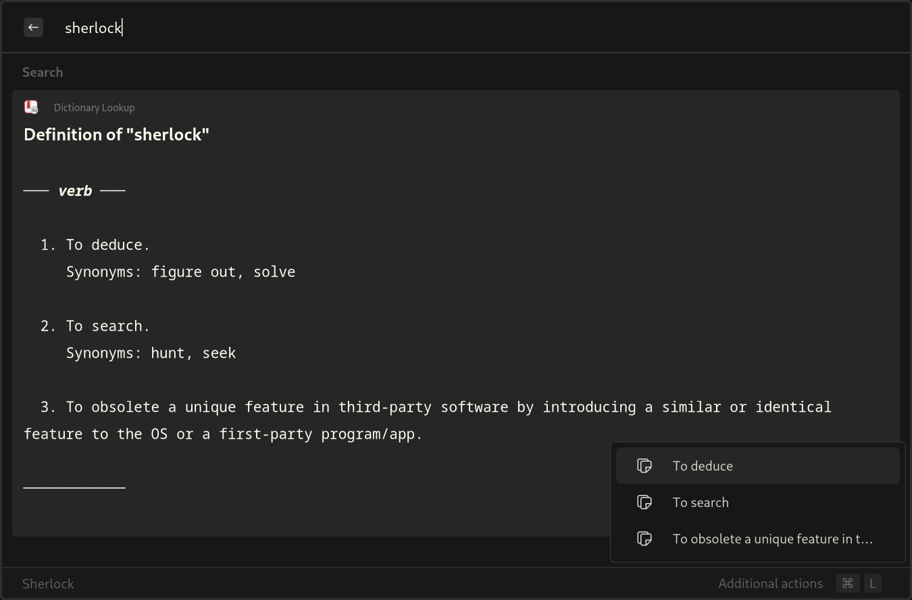

# Sherlock Dict

<div align="center" style="text-align:center; border-radius:10px;">
  <picture>
    
  </picture>
  <p align="center"><i>Application screenshot showing an example.</i></p>
</div>

Much like [sherlock wiki](https://github.com/Skxxtz/sherlock-wiki), this is meant to tap into dict.org

## Installation

1. Clone the repo

```bash
git clone https://github.com/MoonBurst/sherlock_dict_rs.git
```

2. Change directory into the newly created one

```bash
cd sherlock_dict_rs
```

3. Build the binary

```bash
cargo build --release
```

4. Move the binary into the scripts directory

```bash
mv target/release/sherlock-dictionary ~/.config/sherlock/scripts/
```

## Usage

Apply the following to your sherlock's `fallback.json` file and run it with "define $words"

```json
{
    "name": "Dictionary Lookup",
    "alias": "define",
    "type": "bulk_text",
    "async": true,
    "args": {
        "icon": "dictionary",
        "exec": "~/.config/sherlock/scripts/sherlock-dictionary",
        "exec-args": "{keyword}"
    },
    "priority": 0,
    "shortcut": false
}
```

Frankly, I'm not much of a programmer, this is my attempt to make something work though! There's PROBABLY a better way to do all of this.
